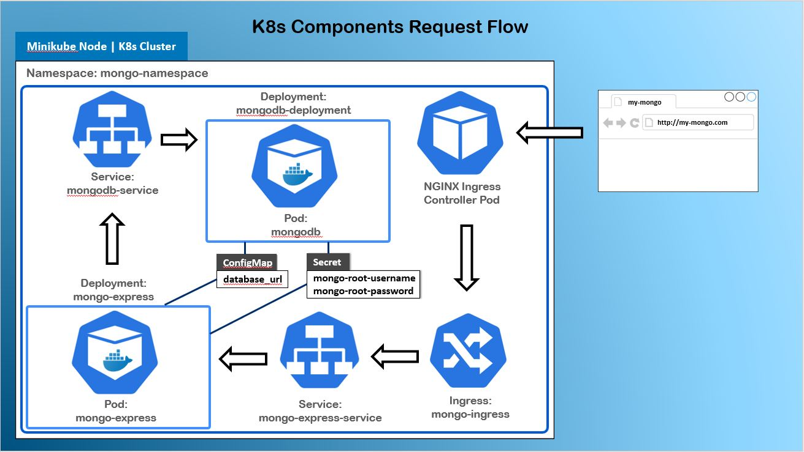

## Kubernetes with Minikube
This project is a basic implementation of kubernetes with Minikube cluster 
running services of mongo-express and mongodb.

### Pre-requisites 
Installation of [Minikube](https://minikube.sigs.k8s.io/docs/start/)

### Basic Concepts with Commands

A Pod (smallest block in k8s) is an abstraction over containers.
- `kubectl exec -it <pod_name> -- bin/bash` : Get the interactive terminal of the pod application for debugging inside 
the pod
- `kubectl logs <pod_name>` : To log a pod

A Deployment is an abstraction over Pods that manages the replica set.
- `kubectl create deployment <deployment_name> --image=<image_name>` : To get basic deployment with minimal values
- `kubectl edit deployment <deployment_name>` : To edit deployment configuration file
- `kubectl delete deployment <deployment_name>` : To delete a deployment

A ReplicateSet is a layer between Deployment and Pod that manages the replicas of a Pod.
- `kubectl get replicaset` : To get replica sets

A Service is a k8s component that acts as a proxy to forward requests to a set of Pods.

A ConfigMap is an API object that provides centralization to store non-confidential configuration data in key-value pairs 
which could be consumed by Pods as environment variables, command-line arguments, or as configuration files in a volume.

A Secret on the other hand is similar to ConfigMap but for storing of confidential information such as passwords, 
OAuth tokens etc.
- `echo -n 'your-password' | base64` : To generate a base64 encoded password which could be used in Secret

A Namespace is useful for dividing resources between multiple users, or separate slightly different versions resources 
(e.g. different versions of the same software). It is like a virtual cluster inside a cluster to help organise resources.
- `kubectl create namespace <name>` : To create a namespace

An Ingress is an API object that provides routing rules to manage the external users' access to the services in a cluster. 
It provides load balancing, SSL termination and name-based virtual hosting.

An Ingress Controller is a Pod in the cluster that evaluates and processes the Ingress rules. 

One of the recommended practice for production is to have an external proxy server which acts as a single entry point. 
It will be responsible for accepting the request from the client and forward the request to the right cluster.
Then, the internal nginx proxy/ingress controller of each cluster will evaluate the defined ingress rules and forward the 
request to different services based on the rules. In this case, by having a single external server as a proxy, the 
clusters are not exposed to the outer world and are only accessible by the external server proxy hence providing security. 

General commands :
- `kubectl get <node | pod | service | replicaset | deployment | secret>` : To get status of different k8s resources/components
- `kubectl describe <node | pods| service> [name]` : To show details of a specific resource or group of resources
- `kubectl get endpoints` : To get the endpoints of a service. (When a service is created, kubernetes creates an 
endpoint object which has the same name as the service to keep track of the endpoints of the service.)
- `kubectl get deployment <deployment_name> -o yaml > deployment-result.yaml` : To output the updated configuration file 
after deployment 
- `kubectl get pods -o wide` : To get extra information of a pod (e.g. ip address)

### Get Started
1 . Start the Minikube which would start a local Kubernetes cluster.
- `minikube start`
- `kubectl get nodes` : To get the worker nodes (there will be only one node with name of 'minikube')

2 . Create a Namespace called 'mongo-namespace'
- `kubectl apply -f mongo-namespace.yaml` 
- `kubectl get namespace` : To check if 'mongo-namespace' is successfully created

3 . Create a Secret that contains the credentials (username and password) for accessing the MongoDB 
- `kubectl apply -f mongo-secret.yaml` : To apply the secret configuration file (before applying deployment that 
reference the secret)
- `kubectl get secret --namespace=mongo-namespace` : To check if the secret is properly created with name of 
'mongodb-secret'

4 . Create a Deployment which is an an abstraction over Pods that manages the ReplicaSets. The deployment will create 
a MongoDB pod. As defined in the configuration yaml file, the MongoDB pod will access the database with the credentials
from the Secret. Besides, a Service is also created as an internal service to allow other Pods in the cluster to communicate
with the MongoDB pod.
- `kubectl apply -f mongo-deployment.yaml` : To apply the mongodb deployment
- `kubectl get all --namespace=mongo-namespace | grep mongo` : To check if the service, deployment, replicaset and pod 
are created for mongodb

5 . Create a ConfigMap that stores non-confidential data, the MongoDB service url in our case, which is referenced
in mongo-express-deployment as environment variable for the mongo-express container to connect to the right MongoDB service.
- `kubectl apply -f mongo-configmap.yaml` : To apply the mongo configmap
- `kubectl apply -f mongo-express-deployment.yaml` : To apply the mongo express deployment
- `kubectl get all --namespace=mongo-namespace | grep mongo` : To check for additional service, deployment, replicaset
and pod created for mongo-express

6 . Install and start the k8s Nginx implementation of Ingress Controller
- `minikube addons enable ingress`
- `kubectl get pods -n kube-system` : To check that the pod 'ingress-nginx-controller' is created 

7 . Create an Ingress for mongo express and access the dashboard via my-mongo.com
- `kubectl apply -f mongo-ingress.yaml`
- `kubectl get ingress --namespace mongo-namespace` : To check on the ingress created and get the assigned ip address
- `sudo nano /etc/hosts` : Update the hosts file by adding an entry to it (e.g. 192.168.0.49.2 my-mongo.com)

8 . (Optional) Create an Ingress for kubernetes dashboard and access the dashboard with kube-dashboard.com
- `kubectl apply -f dashboard-ingress.yaml`
- `kubectl get ingress --namespace=kubernetes-dashboard` : To check on the ingress created and get the assigned ip address
- `sudo nano /etc/hosts` : Update the hosts file by adding an entry to it (e.g. 192.168.0.49.2 kube-dashboard.com)

9 . To stop and remove the services, deployments etc.
- `kubectl delete -f mongo-ingress.yaml`
- `kubectl delete -f mongo-express-deployment.yaml`
- `kubectl delete -f mongodb-deployment.yaml`
- `kubectl delete -f mongo-secret.yaml`
- `kubectl delete -f mongo-configmap.yaml`
